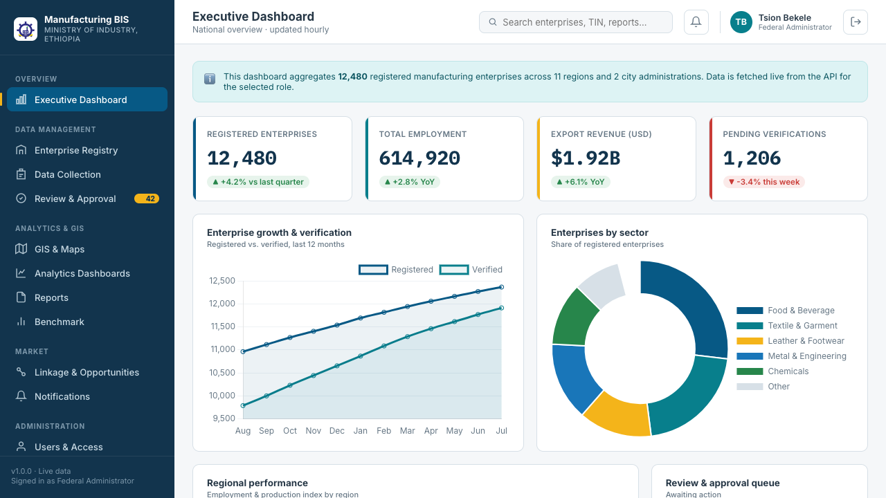
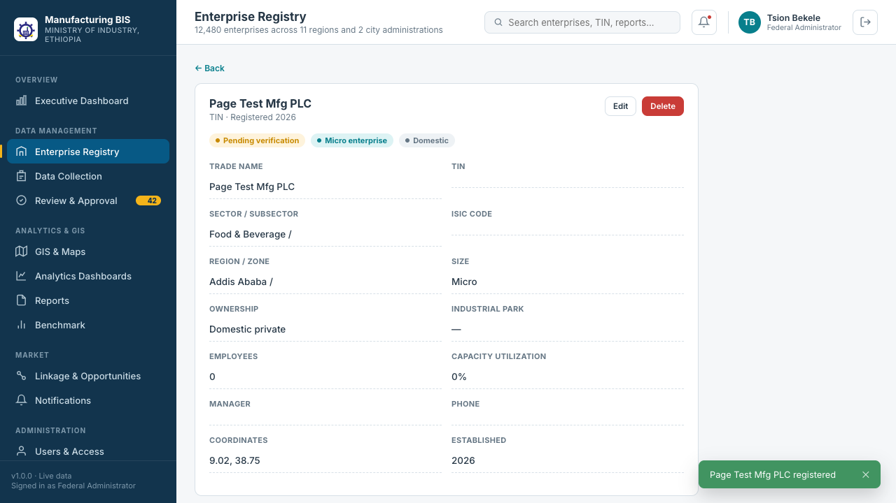
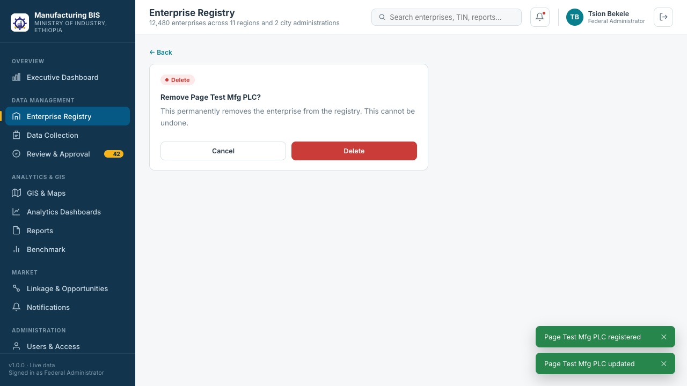

<p align="center">
  
</p>

<h1 align="center">Manufacturing Business Information System</h1>

<p align="center">
  A national platform for registering manufacturing enterprises, collecting and reviewing<br/>
  survey data, and publishing industry analytics — built for the Ethiopian Ministry of Industry.
</p>

<p align="center">
  
  
  
  
</p>

---

## Overview

This repository implements the **Manufacturing Business Information System** described
in [`Documents/`](Documents) — the SRS, module catalogue, and integration matrix drafted
for Ethiopia's Ministry of Industry and Ethiopian Enterprise Development. The UI follows
the visual design in [`UI:UX/backoffice.html`](UI:UX/backoffice.html).

It's a two-package monorepo:

- **`backend/`** — Node.js + Express REST API (in-memory mock data, ready to be swapped
  for a real database).
- **`frontend/`** — React 18 + Vite admin back office.

<p align="center">
  
</p>

## Features

- **Role-based login** — five distinct accounts (Federal, Regional, Woreda, Policy
  Analyst, Enterprise Manager), each with its own credentials, navigation, dashboard,
  and API permissions. See [Demo accounts](#demo-accounts).
- **Role-based access control (RBAC)** — a single permission matrix drives both the UI
  (which nav items and buttons render) and the API (every route is enforced
  server-side, so a role can't bypass the UI by calling the API directly).
- **Multi-level review & approval workflow** — submissions move
  **Woreda → Zonal → Regional → Federal**; only the role tied to a submission's current
  level can approve/reject/return it; returned submissions can be resubmitted by their
  owning enterprise.
- **Full CRUD, on dedicated pages** — Create, View, Edit, and Delete each get their own
  route (no modals or drawers): `/enterprises/new`, `/enterprises/:id`,
  `/enterprises/:id/edit`, `/enterprises/:id/delete`, and the same pattern for Users,
  Collection campaigns, Linkage opportunities, and Reports.
- **Reusable component system** — sidebar/topbar chrome, data tables, filter bars, KPI
  cards, chart cards, and the three generic CRUD page templates
  (`EntityFormPage`, `EntityViewPage`, `DeleteConfirmPage`) are shared across every module.
- **Live data everywhere** — a single `useApiGet` hook backs every page; nothing is
  hardcoded into components.
- **Notifications & snackbars** — a persistent notification bell/panel plus ephemeral
  toast feedback on every create/update/delete/approve action.
- **GIS map, analytics dashboards, and benchmark comparisons** using Leaflet and Chart.js.

<p align="center">
  
  
</p>

## Getting started

Requires Node.js 18+.

```bash
# 1. Backend API — http://localhost:4000
cd backend
cp .env.example .env
npm install
npm run dev

# 2. Frontend — http://localhost:5173 (in a second terminal)
cd frontend
cp .env.example .env
npm install
npm run dev
```

Open **http://localhost:5173** and sign in with any account below (or use the
one-click "Demo accounts" panel on the login page).

## Demo accounts

| Username | Password | Role |
|---|---|---|
| `federal.admin` | `Federal@123` | Federal Administrator — full access |
| `regional.officer` | `Regional@123` | Regional Data Officer |
| `woreda.officer` | `Woreda@123` | Woreda Officer |
| `policy.analyst` | `Analyst@123` | Policy Analyst — view/report only |
| `enterprise.mgr` | `Enterprise@123` | Enterprise Manager — scoped to their own enterprise |

> Demo credentials for local evaluation only — plaintext passwords and in-memory
> sessions are not production-ready. See [Known gaps](#known-gaps).

## Project structure

```
backend/
  src/
    data/          mock data + in-memory "tables" per domain
    middleware/     authenticate / authorize / error handling
    routes/         one Express router per module
    workflow/       the review & approval state machine
    app.js, server.js
frontend/
  public/           logo assets, favicon
  src/
    api/            fetch client + useApiGet/useApiAction hooks
    components/
      common/       DataTable, FilterBar, KpiCard, ChartCard,
                     EntityFormPage / EntityViewPage / DeleteConfirmPage, ...
      layout/        Sidebar, Topbar, AppShell
      notifications/ NotificationBell/Panel, SnackbarHost
    context/        AuthContext, SnackbarContext, NotificationContext
    pages/          one folder per sidebar module
    router/         AppRoutes, ProtectedRoute
Documents/          original SRS, module catalogue, integration matrix
UI:UX/              static HTML mockups the design is based on
docs/screenshots/   README images
```

## Review & approval workflow

`backend/src/workflow/reviewWorkflow.js` models the pipeline from the SRS:

```
Draft → Woreda → Zonal → Regional → Federal → Approved
                                   ↘ Rejected
                                   ↘ Returned → (resubmit) → back to the same level
```

Approving advances a submission to the next level (or finalizes it as `Approved` at
Federal). Reject and Return are terminal for that cycle. Only the role tied to the
submission's *current* level may decide it — Federal can act at any level. This is
enforced in the API (`canDecideAtLevel`) and mirrored in the UI so the buttons don't
even appear for a level a signed-in reviewer can't act on.

## CRUD & permissions

The permission matrix in `backend/src/data/permissions.js` is the single source of
truth, exposed to the frontend via `/api/auth/me`. It governs, per role, per module:
`view`, `create`, `edit`, `delete`, `approve`. Full CRUD (permission-gated, each step on
its own page) is implemented for:

- Enterprises
- Users
- Collection campaigns
- Linkage opportunities
- Reports

Enterprise-role accounts are additionally row-scoped server-side — they only ever see
their own enterprise's records, GIS point, and review submissions.

## Known gaps

- Demo-grade auth: plaintext passwords and an in-memory session map
  (`backend/src/data/sessions.js`) — fine for evaluation, not for production.
- Backend data is in-memory mock data, not a database — routes are structured so a real
  data layer can be swapped in without changing contracts.
- The public-facing `UI:UX/portal.html` mockup was not built into the app; this repo
  covers the back-office/admin application only.
- Audit log and the master-data catalogue stay read/update-only — they're
  append-only/reference records, not day-to-day CRUD entities.

## License

No license file has been added yet — add one (e.g. MIT, Apache-2.0) before treating
this as open source or accepting external contributions.
